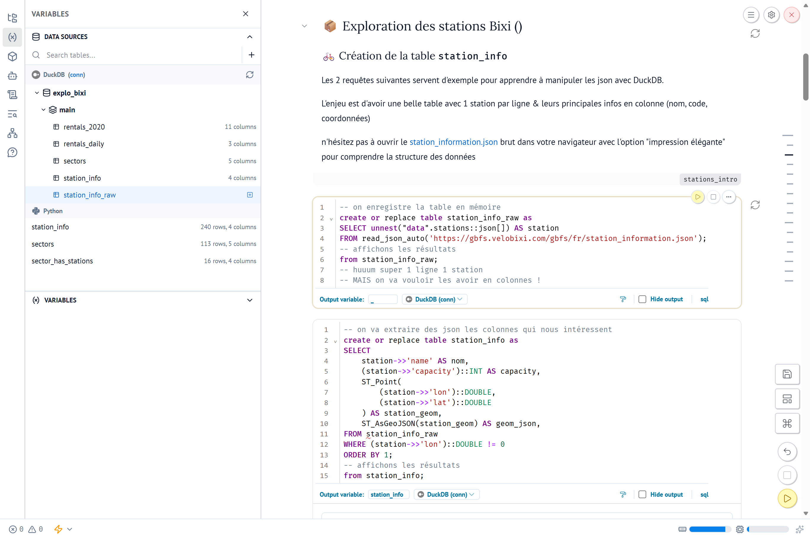
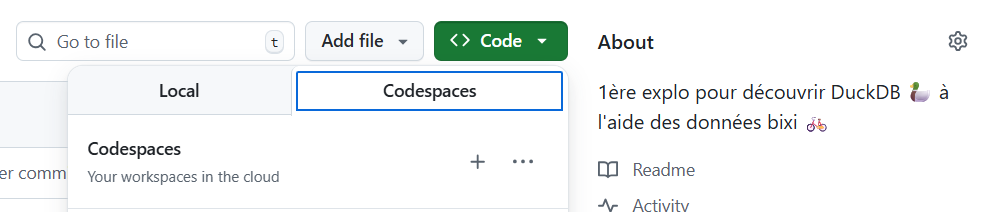

# TD Réduction de dimensions 🦆 avec Marimo & les données bixi 🚲

Ce TD vous guide dans la réduction de dimensions :
- Statuts des **stations** bixi via le feed GBFS (JSON)
- **Secteurs** de Chicago (GeoJSON)
- **Locations** journalières des vélos (Parquet)

Vous utiliserez **DuckDB** et son extension **spatial**.

👉 Certaines cellules contiennent des `TODO` à compléter.



### Usage immédiat via codespaces

Lancez un codespace Github



Une fois connecté, effectuez
-  `uv sync` pour être sur d'avoir les dépendances python à jour
-  `uv run marimo edit marimo_chicago_rentals.py` pour lancer l'app Marimo & débuter le TD

### Installation locale

#### Récupérer les outils

- [git](https://git-scm.com/install/windows) ou
  `winget install --id Git.Git -


   --source winget`
  - Dire à **git** qui vous êtes
    ```shell
    git config --global user.name "PrenomNom"
    git config --global user.email votresuper@email.fr
    ```
- [uv](https://docs.astral.sh/uv/getting-started/installation/) ou
  `powershell -ExecutionPolicy ByPass -c "irm https://astral.sh/uv/install.ps1 | iex"`
- [VS Code](https://code.visualstudio.com/Download) ou [windows store](https://apps.microsoft.com/detail/xp9khm4bk9fz7q?hl=fr-FR&gl=FR)

#### Clone & setup local du projet

- `git clone https://github.com/floriangaudey/marimo_bikeshare_chicago.git`
- `cd marimo_chicago_rentals` <em style="color: grey">se déplacer dans le dossier récupéré avec git</em>
- `uv sync`
  - télécharge **python** <em style="color: grey">si non présent</em>
  - initialise un environnement virtuel python (venv) <em style="color: grey">si non présent</em>
  - télécharge les dépendances / extensions python
- `.venv/Scripts/activate.ps1` (unix `source .venv/bin/activate`)\
  activer l'env virtuel python dans le terminal
    - si erreur d'"autorisation", powershell nous redirige vers une page d'où il suggère pour résoudre le pépin d'exécuter :\
    `Set-ExecutionPolicy -ExecutionPolicy RemoteSigned -Scope CurrentUser`
- `code .` ouvrir dans VS Code le répertoire courrant

#### Lancer le projet marimo

- `marimo edit marimo_chicago_rentals.py`
